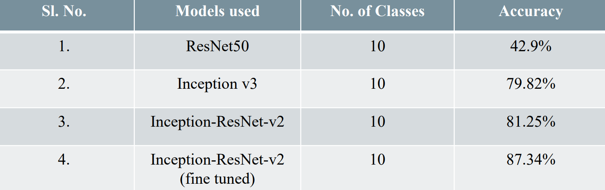

# Different_types_of_Skin_Cancer_Detection_using_DL_Modelsetection_

Here, we have implemented different CNN models for the detection of different types of skin cancers. The dataset consists of 9 classes of different skin cancers along with 1 normal class.

## Contributors:
1. Barsha Chetri
2. Jyoti Singh
3. Rajlakshmi Gogoi
4. Sukonya Phukan

We have obtain the accuracies for different CNN Models as follows:

From this project, we have come to these conclusions:
1. Inception-ResNet-v2 is an architecture gives better results than with either Inception 
or ResNet alone.
2. Moreover, multiclass classification yields poorer results than binary class 
classification but it has more utility in real world as it is not necessary that a 
particular disease will have only two classes.
3. Our proposed Inception-ResNet-v2 model involves some fine tuning which yields 
much better results than the state-of-the-art Inception-ResNet-v2 model.
